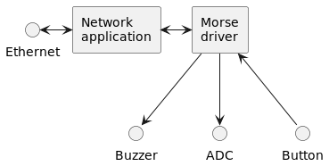

== Overview
The device will accept messages over the network
 and play them back as morse code using both the internal buzzer and ADC.
It will also send messages to a specified address if typed in morse code
 using one of the device's buttons.

The intent is to provide an...amusing means of transmitting messages
 between two people in different parts of a building.

Like the previous assignments,
 there will be a character device driver which accepts messages locally,
 and a networked application which exposes it to the network.
Writing a character to the driver triggers playback.
Reading from the driver retrieves the next character
 entered using the internal button.

////
[plantuml]
----
skinparam componentStyle rectangle

component "Morse\ndriver" as driver
component "Network\napplication" as net

Ethernet <-> net
net <-> driver

driver --> Buzzer
driver --> ADC
driver <-- Button

----
////

//Include at least one block diagram showing all hardware components and interactions.

== Target Build System
I will use Buildroot.

== Hardware Platform
I will use a
 http://www.friendlyarm.net/products/mini210s[FriendlyARM Mini210s].

This device features an ARM Cortex-8 based chip and 512 GB of RAM;
 more than enough to serve as a Linux platform.
It also has an integrated screen and a variety of I/O options,
 including GPIO.
I have one of these in my possession already.

A user has already created buildroot configs to support this platform:
 https://github.com/jrspruitt/FriendlyARM_Buildroot_Support

== Open Source Projects Used
N/A

== Previously Discussed Content
This will incorporate content related to Buildroot,
 and the aesdchar and aesdsocket projects.
Specifically I will be building using buildroot,
 and building an application that incorporates a
 character device and networking.

== New Content
I will be incorporating direct hardware access to operate the buzzer.

== Shared Material
N/A

== Source Code Organization
The Buildroot repository will be hosted here.

== Group Overview
N/A

== Team project members:
Adrian Hall:: Solo developer

== Schedule Page
TBD: Include link to shared schedule wiki page below.